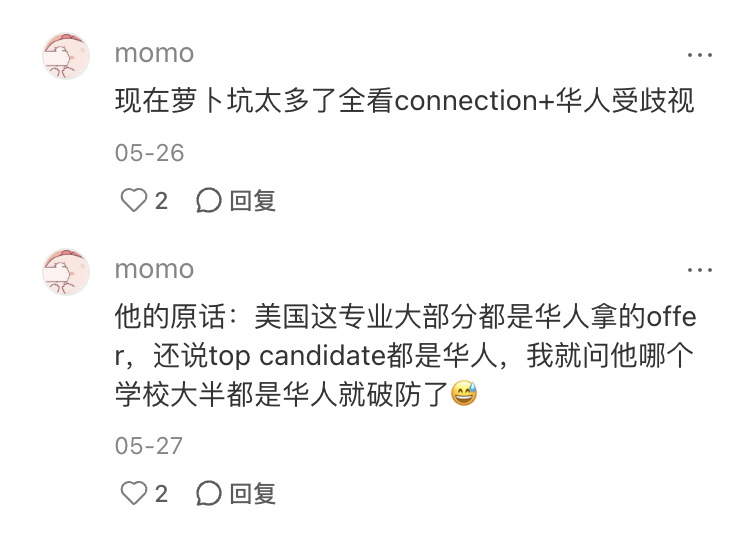

# 我的博士申请经验 (Fall, 2025)

[Hongjie (Harry) Qian](https://github.com/hongjie-qian), MS BScPharm \
Aug 2025

很高兴你也决定申请药学流行病学！希望我们可以成为同行 ：）

能走到这一步，相信你也是要么有药学背景、要么有公共卫生背景、或者你还有经济学背景，而且对群体之中的药物使用和其成果产生了极大兴趣；并且，你已经下定决心在接下来的4～6年内投入大量的时间和精力去进行扎实的定量研究。恭喜你，大门就在你的眼前。

我努力赶在今年申请季 (Fall, 2026) 开始之前完成我的申请经验，希望能对你有帮助 —— 届时也希望你<a href='https://www.pharmacoepi.org/meetings/annual-conference/'>2027年ISPE年会在西雅图</a>来找我玩呀！（<a href='https://www.ispor.org/conferences-education/conferences/upcoming-conferences/ispor-2026'>2026年ISPOR在Philly的年会</a>我也会去！） —— 要去的话赶紧email/PM我！！！（笑

## 0. 我的申请结果

🈸 21 Applications | 🎉 10 Offers | ✖️ 11 Rejection

（鉴于加拿大🇨🇦学校的时间线非常不一样，我就单独列出来，没有放在图里的美国🇺🇸学校里了）

-   UBC | Pharmacology - Offer
-   Waterloo | Pharmacy - Offer

<figure>
    
</figure>

## 1. 申请前的准备

### 1.1 我的背景

-   学历
    -   本科：CPU BScPharm + Strathclyde BSc (Hons) Biochemistry & Pharmacology, upper second class
        -   原谅我大四在忙申请+被苏格兰冬季的阴天搞抑郁了。。。所以没好好准备degree test就成功2.1 class了（其实我觉得非英联邦国家是毫不在意degree class的，拿不到1st class对我来说没有太大影响。）
        -   相关经历：1年药用资源学实验室、2年定量药理学实验室、毕设在做神经图像统计分析。

    -   硕士：UCSD MS Biostatistics
        -   RA: 1.5 year, Pharmacoepidemiology in Cardiovascular Diseases
        -   Industry: Summer Internship in Data Science in Mega Pharm

-   奖项
    -   iGEM 2021 Gold Medal
        -   纯纯水奖。。。不堪回首的队伍。。。感谢Zekai兄carry我。。。
    -   数模美赛M奖
    -   。。。杂七杂八 

-   出版
    -   1篇Pharmacoepi第一作者论文under review🙏
    -   1篇Pharmacometrics四作已出版
    -   海报：一个校内的、一个美国临床药学会的、一个公司实习的

如你在我的[GitHub主页](https://github.com/hongjie-qian) or [个人网站](https://hongjie-qian.github.io/)上看到的，我的背景主要是药学、特别是临床药理学和生物统计——当然我硕士期间修了大量的流行病学课。

我的本科做得非常非常杂 —— 因为我最开始修药学是我真的不想在高等教育阶段学物理。。。真的好难（我爸：科科）。当然我对药物本身是充满热情的，直到现在也还在继续。我大一暑假在药物化学实验室、大二去了一个非常非常非常烂的药用资源学实验室和一个学校里的转化实验室大组打杂，大三才确定我对临床更感兴趣且不愿再做实验（宁死不屈那种）、加入了当时仰慕已久的校内唯一一个专门做定量药理学（Pharmacometrics/PMX）的实验室。由上可见，我的本科经历是一个非常典型的“杂而不精”的典型，好在最后的重心落在了临床药理学（Clinical Pharmacology）。

在申请PMX博士的时候，为了避免没学上，我的硕士申请主要还是申请的生物统计 —— 既然要做定量研究了，为什么不先补补数学么？毕竟CPU的数学教学真的很糟糕（没有说上我课的老师的水平糟糕，特别很爱YB老师，还带了我几次数模竞赛；但是我连线性代数都只能旁听，那你觉得CPU非生统的学生到底该怎么做定量？难道需要继续和那些学校里的典型人一样继续一天到晚benchwork么？）。。。而且我当时对population PK (popPK) 很感兴趣。当时拿了密歇根、杜克和SD的MS Biostatistics的offer后，最后选择了UCSD的 —— 主要的原因是我Duke的没交deposite：因为当时拿到Purdue的offer我真的以为我会直博的。。。不过所幸来了UCSD、乃至可以说没去Purdue真是万幸（Purdue，指这个学校，我的一生之敌谢谢——要是现在去了保不齐被[蒋某](https://zh.wikipedia.org/zh-hans/%E8%92%8B%E6%BF%9B)整）；来了UCSD才遇到一个比较小的MS cohort，遇到了很舒适的环境、总体很nice的同学、当然也结交了很多很多知心好友，也遇到了这么照顾自己的老师和师姐、也终于认识了自己未来要从事的方向。

后面就是我最终来做药物流行病学的过程啦，[参见这](Experience.md)。

### 1.2 研究方向

关于我的研究方向，我非常大一部分的考量是基于我的临床药理学的背景、乃至我此时此刻还需要我的临床药理学背景来帮助我思考药物流行病学的问题。因为我本科的主要的project是看抗癌药物的心脏毒性，这使得我对心血管和癌症更有兴趣。而我在硕士老板的lab的课题和大药企的项目也分别给了我慢病、癌症和精神类疾病的研究背景基础。

#### Tip: 个人背景 + 研究方向 = 整体的目标 ～ *N*(申请结果, |上下限|2)

我觉得研究方向的选择和研究方向的确定加起来决定了你的整体目标且和申请结果有着直接的关系（*p* \< 0.05, not *p*-value hacking哈哈）。你的背景决定了你的研究动机和你的整体水平，定义了你这个申请季的绝对定位；你的研究方向决定了你在单个项目的申请相对定位。

可能我这么说你会觉得很抽象、不知道我到底在说什么，那我举个例子🌰好啦：

> 我们以学生X为例：（我这里完全在manipulate这个例子，无任何投影！）
> - X的背景是纯生物，其在本科里的研究也都是以转染质粒、提纯蛋白、免疫组化这种典型生科湿实验为基础，没有任何定量科研经验和定量课程（只有医药类学科的A级高等数学和A级概率论/数理统计等于大学没学数学，谢谢）。
> - X觉得自己未来如果不做干实验/定量研究，文章成果可能不一定很好，所以决定申请干湿结合的转化方向/Translatinal Sciences。
> - 但是在X找对应项目的时候，全部申请了高度依赖定量技能的转化实验室。
> 
> 那你觉得A能上岸么？

### 1.3 语言能力

对于大部分申请药物流行病学的大陆学生来说，其硕士基本都在海外就读、都能凭借硕士学位免去语言考试。有一小部分学校是硕士学位不免语言考试的，这种情况下需要提前准备好语言考试 —— 我自己本科的英方学校让我免除了所有语言考试（感谢S大again）。

如果在这方面有困难，一方面我觉得雅思（IELTS）真的不是很难，另一方面可以考虑一下语言成绩满足不了的话、那对需要大量交流沟通的公共卫生、涉及临床课题的药学都会产生不小的障碍。

GRE？我个人觉得这个是一个马上被时代淘汰的产物。虽然我第一次申请硕士/博士的时候也考过，但是分数真的很低，在纯申请PhD的时候我也没再拿出来（不然丢脸丢大了！）。现在很多学校都不再要求GRE成绩了（除了很pharmacoeconomics的UW CHOICE，当然我也因为它太太太econ了我申都没申——其实是因为陶瓷人家没回我。。。）。

### 1.4 推荐人

一直都非常感激自己的申请人。三位老师/前辈都是我一直以来非常非常尊敬的。体感是申请信的老师最好是真真正正了解你可以言之有物、同时如果老师也是在这个领域内工作且很卓越/有名气的话，推荐信的质量会更高。

我的三位申请人分别是：

1. 我硕士的老板 —— 不用多说。。。一直都很爱她 ❤️！！！She is awesomeeeeeeeeee! 正如某人所言：“RISING STAR!“（我觉得可以把rising去掉了哈哈哈）时常回顾这段，一直会被自己的硕士老板和师姐所温暖到。

2. 我硕士高级流行病学方法课的老师 —— 首先是这门课我真的有在努力学，而且老师人真的非常非常热心（字面意义那种，人特别好 ❤️），更有甚者、她的研究一部分也在做药物流行病学，也努力在把自己领域的流行病学里加上用药的考虑、也就是在往药物流行病学转，所以她非常理解我的申请动机也知道什么项目最适合我。
    -   我特别很在意且很感激的一点是她对我的目标和现状有着清晰的认识：我相信她给我写的推荐信肯定是很积极的，但是她自己作为UCSD/SDSU自己的JDP的Co-director（其实隔壁SDSU的Co-Director人也蛮好的，虽然我没咋和她接触过那么多），无论是考虑到自己的项目（毕竟只有我硕士老板在做p-epi）和我的目标导向和背景，她在纠结很久之下决定不给我offer —— 我一开始肯定觉得很遗憾，但是随着时间和推移和与她的进一步交流，她的深思熟虑和远见着实是能让我理解并佩服。

3. 我硕士暑假在Mega Pharm实习时候的老板 —— 极其supportive ❤️，在各个方面都很支持我，而且我实习的内容也和RWE很相关，算是我职业发展起步的最重要的见证人之一。

我自己觉得这个申请信package是自己脑海中最优化的了：毕竟药物流病是一个兼顾科研成果和产业应用的极度交叉的学科，我觉得在我的学术能力、学习能力和产业经历这三方面都有对应的阐述是非常有帮助且全面的。

### 1.5 选校

其实可以掰掰手指头算一下，整个美国有多少个P-Epi/P-Econ/Pharm-HEOR项目，算下来其实我申请的学校可能都占了这里面的一半了：本科申请直博被Purdue摆了一道实在是让我很PTSD、所以我申请很多；但是很多专注于药物经济学的项目（比如说口碑很好的UW CHOICE、USC——虽然只在双数年招生、UColorado）和更特别专注于药物健康服务研究的项目我都没申请，同理一些纯彩票性质/国际生funding有问题的学校（比如Harvard、JHU、UCSF、UCLA）我也都没申请。

我的申请学校项目基本都是有严格定义上的做药物流行病学的老师。因为本身就是就业导向、并且根据陶瓷结果不断调整自己的定位，选择了这么一个list —— 我觉得是尽可能把风险降到最低了、至少保证自己没失学。

特别注意的是 —— Pharmacoepidemiology $\ncong$ Epidemiology!

同时，因为我毕竟自身也还是蛮喜欢PK/PD做的东西的，而且其实算下来我开始准备申请PhD（24年上半年）那时候我其实药流还没咋做那么久，所以我还是酌情申请了几个，但是在这里我就还蛮挑的——一定不能做湿实验、一定要是工业界导向的老师、一定不能是UNC/UCSF/Buffalo这种PK/PD Tier 0的学校（所以我亲爱的本科<a href='https://scholar.google.com/citations?user=Is4tffoAAAAJ&hl=en'>Jiang师姐</a>真的超级厉害！！和我一年，一口气拿下Buffalo和UNC的offers，天选PK/PD人，一直都很钦佩服她～）

同时，由于复杂、多变且当时乃至当下依旧极度不稳定的国际局势，我酌情挑了两位加拿大的老师来申请：两位老师聊下来人都很不错，而且对研究领域的思考也很深入，我也申请了他们的PhD岗位。

PS：请善用**NIH RePORTER**！！！

> 常话道，「<a href='https://www.bilibili.com/video/BV1vx411K79Y/'>遇见新东方厨师就嫁了吧？</a>」
>
> 在当下，遇到一个有R01或K99/R00的老师就求着去吧。。。甚至有K01或R21都好啊。。。（叹气）

## 2. 申请过程

### 2.1 陶瓷

我的陶瓷开始得非常早：大概7月多就开始了。很抱歉，我第一轮陶瓷都是PK/PD的 —— 算是beta test吧。。。很怕自己陶瓷信写得很烂。。。陶瓷了几个著名的老师 —— 毕竟自己也不想abuse自己和老师的时间。不过的确是碰到了一位那种完全没法交流的老师（做PK/PD的你，可以猜猜看到底是谁？笑。）

后面大概在8月下旬就开始陶瓷药流方向的了（真是抱歉。。。当年没想到8月下旬还有ISPE年会，估计那时候大家都忙死了）。我基本上是根据我自己从5月多就开始列的list来，基本上每周陶瓷几个，直到10月初。我申请的每个学校都拿了informal —— 因为要申请很多学校，所以不是很想浪费钱。

我的陶瓷信结构蛮简单的，先介绍自己是谁 —— 我的基本教育背景 —— 我的研究经历 & 和老师的研究经历的吻合之处 —— 表达一下想informal，同时我把我的CV给附上了。

陶瓷完就赶紧总结陶瓷 \& Informal的内容，进而定下选校名单吧！

### 2.2 申请材料

我强烈建议：当你确定你会申请这个学校的同时，请把这个学校的申请portal给找到并且注册好。这么做我不觉得是在把时间零散化；相反地，这么做的目的主要是为了在写文书之前提前把自己需要做的东西准备好 —— 毕竟每个学校的文书要求不一样，而且有很多学校都会要求那种零零碎碎、杂七杂八的小文书。提前知晓自己需要完成的材料对于自己的时间规划来说极其重要，特别是如果你和我一样在申请上毫无自信、进而申请很多学校的话，那更是能避免火烧眉毛的不可控局面。

一般来说，申请材料主要是CV、推荐信和个人陈述/Personal Statement (PS) and/or 目的陈述/Statement of Purpose (SOP)。我在这里不多做赘述 —— 网上讲述这些材料的见解够多了，不缺我一个。

#### Tip: 我的申请表格里有什么？

感谢<a href='https://iphg.biostat.washington.edu/profile/chengshuyan'>Susie Cheng女士</a>早我一年的建议，我非常非常赞成一个观点：一个好的申请总结表格可以起到在整个申请季里提纲挈领的作用。这个表格需要精炼、全面、简洁。

我在这里把我的表格里包括的内容都放在下面了，希望对你有启发。

> | School       | Program   | Status      | Type         | DDL        | <a href="https://www.ice.gov/doclib/sevis/pdf/stemList2024.pdf">STEM</a> | Web  | Portal | Responds | Informal | PS  | SOP | 
> | ------------ | --------- | ----------- | ------------ | ---------- | --- | ---- | ---- | --- | ------ | --- | --- |
> | A University | Program 1 | Submitted   | Epi/Outcomes | 2024-11-28 | YES | Link | Link | YES | YES    | YES | NO  |
> | B University | Program 2 | Interviewed | Epi/Outcomes | 2025-12-01 | YES | Link | Link | YES | NO     | NO  | YES |

### 2.3 申请时间

我的时间线大概是：

-   我在10月中旬基本上陶瓷和informal全部结束、确定选校名单了。

-   在11月开始之前，我花一周把我的PS、SOP和Diversity statement的草稿都写完了，并且花了1周时间把这些文书都Polish up了一下（感谢freelance和LLM🙏，我自己也改得很痛苦。。。）

-   在感恩节之前，我每周分批次把所有学校的文书都根据自己的PS、SOP大纲上修改完成提交。

### 2.4 面试准备 \& 面试过程

我觉得这一点我也没啥好讲的 —— 一是网上很多人讲的特别好，二是我觉得面试的经验只能是多练才可以拿到。。。所以蛮感激自己前一年铁了心找暑假实习、然后面了特别多场面试。

关于Campus visit这个，我自己其实主要是想去各个地方玩。。。嗯。。。所以我感觉当时自己蛮放松的。。。

## 3. 机会反转——选择学校和导师

首先可以得出的结论是：25fall基本上所有项目的招生规模、或者说是发的offer数量在我的观察里都是直接减半了的。所以可以机会反转，也真是万幸。

我自己因为对于监管机构和业界的倾向性蛮大的，我的offer选择也主要是基于如下的几个角度：

1.  未来的老板。不解释，这点肯定是最重要的 —— A good mentorship is a good marriage, by Prof Qian Sr.

2.  研究角度/疾病领域：看个人爱好和毕业后目标 —— 你想去哪？

3.  Funding：我真的求求NIH正常发funding。

4.  位置：毕竟就业导向，位置对咱们这个行业来说真的蛮重要的。

这几个因素综合考虑之下，我选择Rutgers就是一件很顺理成章的事了。

## 尾声

去年申请季对我来说很累很累，虽然收获远超我的满足，但是的的确确是申请完有一种被扒了一层皮的感觉。

根据我这些年的观察，美博的申请难度在此般市场和经济情况下，只有越来越内卷、越来越夸张。但是，相信既然你有勇气走到申请的这一步，你也绝对是有机会、有能力、有把握上岸的。祝大家各自努力！

## Q&A

### 1. 萝卜坑？歧视？

<figure>
    
</figure>

这个算是我去年看到最好笑的一个发言。

-   我不知道是因为这位在英国还是怎么样，至少根据我自己在英国的经历来说，种族歧视无论在英国还是美国都是一个非常、非常严肃的指控。至少在我们这个领域里，我自己不觉得种族歧视有被容忍的空间 —— 我当然有过被某个公共卫生Top校某项目的前招生主任种族歧视的经历，但是这也是个例，完全不是在每个学校的招生时候的制度性、系统性的行为。你可以说某一个学校的某个院系从观察上来说比较“白”——因为的确有这种院系，但是因为这就把整个领域喊作“种族歧视”实在是夸张不过。而且至少，身处公共卫生院/药学院，我所受到的种族歧视的风险是明显小于其他院的。甚至在招生上，如果有任何种族上的考量，那下场完全是不堪设想的 —— 这么指控实在是居心叵测。

-   RWE/HEOR总体来说是一个亚洲人/亚洲族裔含量很高的方向，因此这个方向的Top candidate事亚洲人应该是很容易理解的。我觉得理解不了大概率是真的没有努力在了解/被自己的视野给蒙蔽了。更何况，即使是身边统计学，但是这么多学校的申请下来，我遇到的亚洲人/族裔、特别是东亚裔和南亚裔的比例是明显非常高的。

-   Connection没有意外，必然是申请的一部分，甚至我们方向某「Top校」连续几年的博士新生都有很强的connection痕迹；可是没有connection上岸，我自觉在我们这个领域并不罕见 —— 拿着点埋怨，似乎是有些莫名其妙了。

