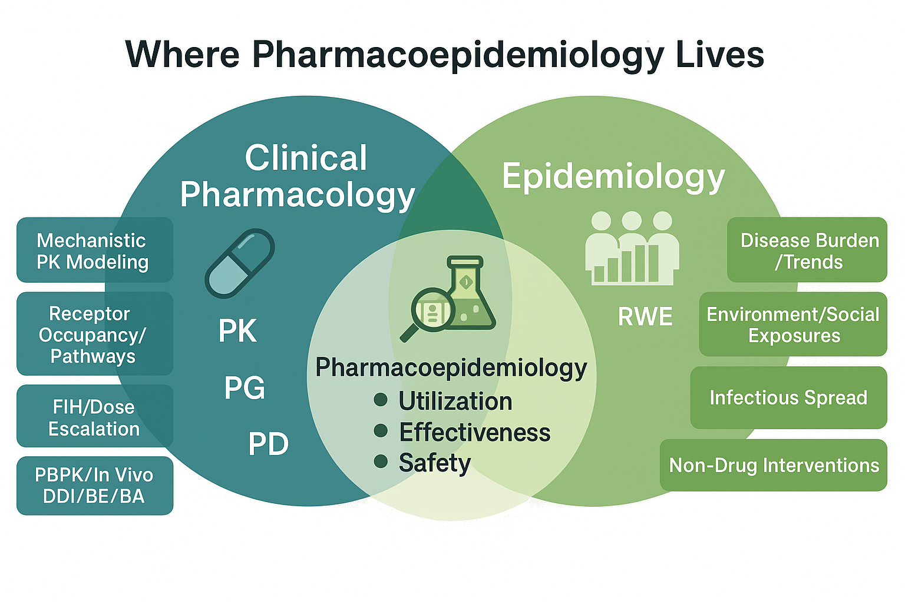

# This is Harry on GitHub! 💊

👤 **Hongjie (Harry) Qian, MS BScPharm**  
🎓 **PhD Student in Pharmacoepidemiology**, Rutgers University (Fall 2025 ~ Present)  
📍 New Brunswick, NJ  
🌐 [Personal Page](https://hongjie-qian.github.io) | 📧 [Email](mailto:hongjie.qian@rutgers.edu) | 💼 [LinkedIn](https://www.linkedin.com/in/hongjie-qian/)

---

## 🚀 About Me  

I am a pharmacoepidemiology \& outcomes study researcher with a background spanning **biostatistics**, **clinical pharmacy/pharmacology**, and **drug safety**. Currently, I am beginning my PhD in Public Health - Pharmacoepidemiology at Rutgers University, focusing on **real-world data analytics**, **causal inference**, and **regulatory sciences** to improve medication safety and therapeutic outcomes. My research leverages large-scale health \& medical databases from diverse sources, and applies advanced quantitative methods to address pressing drug safety questions in vulnerable populations.

Before my doctoral studies, I completed my MS in Biostatistics at UC San Diego and a pharmacy degree in both China Pharmaceutical University and University of Strathclyde. I also gained industry experience at Arcus Biosciences (Clinical Pharmacology, Summer 2025) and Johnson & Johnson Innovative Medicine (Data Scicence \& Digital Health - Global Development, Summer 2024). Positioned at the intersection of data science, epidemiology, clinical pharmacology, and (bio-)statistics, I aim to bridge real-world applicability, and maintain a strong interest in scientific communication, public health policy, and equitable representation in patient data.

<figure>
    
</figure>

## 📚 Education  
- **PhD Student, Pharmacoepidemiology** – *Rutgers Center for Pharmacoepidemiology & Treatment Science ([PETS](https://pets.rutgers.edu/))* (2025–)  
- **MS, Biostatistics** – *Division of Biostatistics & Bioinformatics, Herbert Wertheim School of Public Health and Human Longevity Science, UC San Diego* (2023–2025)  
- **BScPharm** - *China Pharmaceutical University \& University of Strathclyde* (2019-2023)

## 👣 Why, How Pharmacoepidemiology and Grad Application (in Mandarin, 🚧 in construction)

To learn about my trajectory to pharmacoepidemiology and some suggestions in grad applications, click <a href="Doc/pharmacoepi.md">here</a>.

> 曲径通幽处，禅房花木深。 —— （唐）常建 《题破山寺后禅院》  
> A winding path leads to a secluded place, where a Zen retreat lies hidden amid flowers and trees. — From *“Writing on the wall of a hall at Poshan Temple”* by Chang Jian, Tang Dynasty
>> Poshan Temple/Broken-Mountain Zen Retreat (破山寺, now <a href="https://en.wikipedia.org/wiki/Xingfu_Temple_(Changshu)">Xingfu Temple/兴福寺</a>) is a famous temple in my hometown, Changshu, Jiangsu.

## 🔗 Useful Links

| Description                                                       | Link                                 | Description                             | Link                                |
|-------------------------------------------------------------------|--------------------------------------|-----------------------------------------|-------------------------------------|
| International Society for Pharmacoepidemiology                    | [ISPE](https://www.pharmacoepi.org/) | American Diabetes Association           | [ADA](https://www.diabetes.org/)    |
| International Society for Pharmacoeconomics and Outcomes Research | [ISPOR](https://www.ispor.org/home)  | American Heart Association              | [AHA](https://www.heart.org/)       |
| American College of Clinical Pharmacy                             | [ACCP](https://www.accp.com/)        | American Geriatrics Society             | [AGS](https://www.americangeriatrics.org/) |
| American Society for Clinical Pharmacology and Therapeutics       | [ASCPT](https://www.ascpt.org/)      | American Society of Nephrology          | [ASN](https://www.asn-online.org/)  |
| The Society for Epidemiologic Research                            | [SER](https://epiresearch.org/)      | AcademyHealth                           | [AcademyHealth](https://www.academyhealth.org/) |
| American Public Health Association                                | [APHA](https://www.apha.org/)        | American Pharmacists Association        | [APhA](https://www.pharmacist.com/) |

